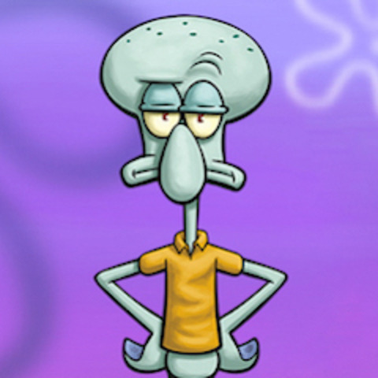

# Homework-2  <!DOCTYPE html>
<html lang="en">
  <head>
    <meta charset="UTF-8" />
    <meta name="viewport" content="width=device-width, initial-scale=1.0" />
    <title>Kyles Awesome Page</title>
    <link rel="stylesheet" href="./style.css" />
  </head>
  <body>
    <h1>MY COOL PAGE</h1>
    
    
    <main>
      <h3>About Me</h3>
      

        Lorem ipsum dolor sit amet consectetur, adipisicing elit. Excepturi
        eligendi voluptas error tempora nesciunt dicta amet, tempore, quasi
        consequuntur assumenda accusantium quod voluptate doloribus mollitia
        nulla autem! Earum, corrupti dolorem.Magnam mollitia autem iste
        cupiditate, adipisci quae! Sequi aspernatur commodi ea, corporis dicta
        minus. Labore, expedita eum autem incidunt tempore blanditiis earum,
        alias totam ducimus eligendi exercitationem voluptatem aliquam deserunt?
      

    </main>
  </body>
</html>
